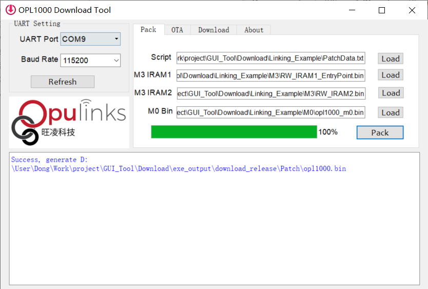
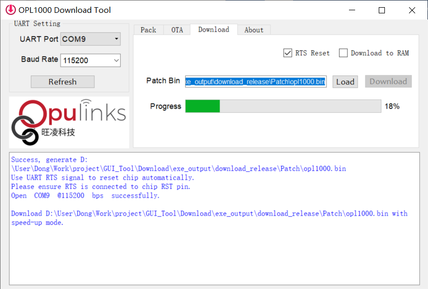

## Description 
Expand M3 RAM demo shows how to use M3 shared memory to enlarge M3 MCU avaliable RAM size for application.
In current design there is a 16k Byte shared memory located from 0x80000000 address, length is 0x4000 (16kBytes)
Normally this part of RAM is used for data exchange, not opened for program use. But when RAM size is not enough to run program, this part of memory can be used to store program code.    
The work principle is 
 - In SCT(scater) file, define SHM_REGION (Shared Memory Region) start address and length 
 - Define a macro-definition use "__attribute__((section()))" to build the initialization function table, for example "SHM_DATA"  
 - In user application code, use SHM_DATA to set certain function attribute if want to place it in shared memory
 - In APS_Patch sys_init_patch.c file (under APS_PATCH\project\opl1000\startup folder), modify one instruction to open block11 (shared memory 0) 
After implement above actions, specified functions of user application will be placed in shared memory, which means normal M3 RAM size are expanded.
   
## Implement method 
1. In user application code define macro-definition SHM_DATA. In this example it is defined in main_patch.c
``` c code 
#define SHM_DATA    __attribute__((section("SHM_REGION")))
```
2. For the functions or variables that need to placed into shared memory, add "SHM_DATA" attribute in definition. 
   In this example, Main_AppThread_1 and Main_AppThread_2 are placed into shared-memory 
``` c code
SHM_DATA static void Main_AppThread_1(void *argu);
SHM_DATA static void Main_AppThread_2(void *argu);
SHM_DATA static void Main_AppThread_1(void *argu)
{
    ...
}
SHM_DATA static void Main_AppThread_2(void *argu)
{
    ...
} 
```
3. In project SCT(scater) file, define shared-memory section like below
``` c code
#define SCT_SHM_START 0x80000000
#define SCT_SHM_LEN   0x00004000

LR_IROM2 SCT_SHM_START SCT_SHM_LEN
{
             RW_IRAM2 +0 
            {
                .ANY (SHM_REGION)
            }
}
ScatterAssert(ImageLength(LR_IROM2) <= SCT_SHM_LEN)
```
4. In sys_init_patch.c file Sys_SwitchOffUnusedSram function that used to define unused SRAM function, open shared-memory 0  
``` c code
void Sys_SwitchOffUnusedSram(uint32_t memFootPrint)
{
	...
    //uint32_t offMsk = (1 << 11);   // block 11 off (shared memory 0)
	uint32_t offMsk = 0;             // changed to "block 11 on" (shared memory 0)
	...
}
```
Because sys_init_patch.c belongs to SDK lib. Hence we have to re-build SDK lib to make above modification effective. 
5. Modify project binary create batch file opl1000_app_m3.bat, add below two lines
``` c code
REM If multiple binary file output, force add extension name ".bin"
        IF EXIST %OBJ_PATH%%OUTPUT_NAME%.bin\* REN %OBJ_PATH%%OUTPUT_NAME%.bin\* *.bin

```
6. Rebuild SDK lib. Open "opl1000_sdk_m3.uvprojx" or run "Makefile" under SDK\APS\project\opl1000 folder to rebuild "opl1000_sdk_m3.lib"
7. Build user application by open "opl1000_app_m3.uvprojx". Note in order to use original project setting, user application shall be placed under "examples" folder; For example we place Expand_M3_RAM\Src under SDK\APS_PATCH\examples\get_started\Expand_M3_RAM

After above 7 steps are implemented two M3 bin files are created under Output\Objects\opl1000_app_m3.bin, they are 
- RW_IRAM1_EntryPoint.bin
- RW_IRAM2.bin
  
## Validate "M3 RAM expand" function  
1. Run download tool (version v0.29), pack multiple M3 bin and M0 bin files together. 

Note: 
 - M0 bin file "opl1000_m0.bin" has been provided under Demo\Expand_M3_RAM\FW_Pack folder. It is same as that under root directory FW_Pack folder.
 - Pack script file shall use PatchData.txt under Demo\Expand_M3_RAM\FW_Pack. It is different with that under root directory FW_Pack folder.
    In this file two M3 bin files are defined. 
``` c code  
4,CODE,COLD,M3
0x004164a0,.\RW_IRAM1_EntryPoint.bin
4,CODE,COLD,M3
0x80000000,.\RW_IRAM2.bin
```
2. Download packed firmware,like below figure 

3. Open an UART debug tool to monitor OPL1000 APS port output information. Below message indicates firmware execution normally.
    [80000001] and [8000001d] are Main_AppThread_1/Main_AppThread_2 function pointer address, they belong to shared-memory begining address,     
``` c code 
>at+switchdbg=1

C!
Switch: Dbg UART
>Hello world 17, Main_AppThread_1[80000001], Main_AppThread_2[8000001d]
Hello world 18, Main_AppThread_1[80000001], Main_AppThread_2[8000001d]
Hello world 19, Main_AppThread_1[80000001], Main_AppThread_2[8000001d]
Hello world 20, Main_AppThread_1[80000001], Main_AppThread_2[8000001d]
Hello world 21, Main_AppThread_1[80000001], Main_AppThread_2[8000001d]
Hello world 22, Main_AppThread_1[80000001], Main_AppThread_2[8000001d]
Hello world 23, Main_AppThread_1[80000001], Main_AppThread_2[8000001d]
Hello world 24, Main_AppThread_1[80000001], Main_AppThread_2[8000001d]
Hello world 25, Main_AppThread_1[80000001], Main_AppThread_2[8000001d]
Hello world 26, Main_AppThread_1[80000001], Main_AppThread_2[8000001d]
```

